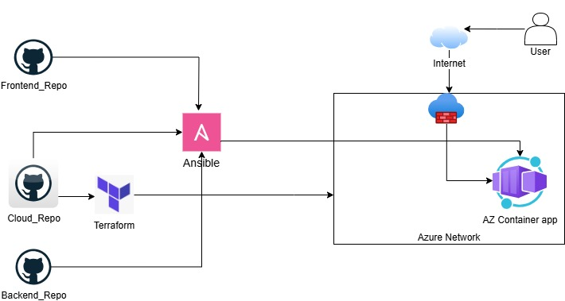

# ARCHITECTURE:


## PREREQUISITES:
## Install Azure CLI:

```
curl -sL https://aka.ms/InstallAzureCLIDeb | sudo bash
```
## Login to Azure

```
az login
```

## Set credentials to env variables:

```
export TF_VAR_DOCKER_REGISTRY_USER="docker username"
export TF_VAR_DOCKER_REGISTRY_PASSWORD="docker password"
export ARM_SUBSCRIPTION_ID="azure subscription ID"
export TF_MYSQL_ROOT_PASSWORD="mysql password"
```

## Deploy terraform

```
terraform apply --var-file="credentials.tfvars" --auto-approve

```

