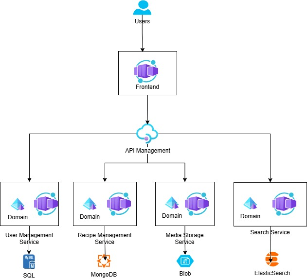

## config.tf && providers.tf

1.Configure storageaccount in config.tf to your storageaccount

2. Configure subscription ID in providers.tf

## Azure login

```
az login
```

## Deploy in Powershell

```
Set-Item -Path env:TF_VAR_DOCKER_REGISTRY_USERNAME -Value 'user'
Set-Item -Path env:TF_VAR_DOCKER_REGISTRY_PASSWORD -Value 'pass'
Set-Item -Path env:TF_VAR_MYSQL_ROOT_PASSWORD -Value 'pw'

./deploy.ps1
```

## Deploy in Bash

```
export TF_VAR_DOCKER_REGISTRY_USERNAME="user"
export TF_VAR_DOCKER_REGISTRY_PASSWORD="pass"
export TF_VAR_MYSQL_ROOT_PASSWORD="pw"
```
